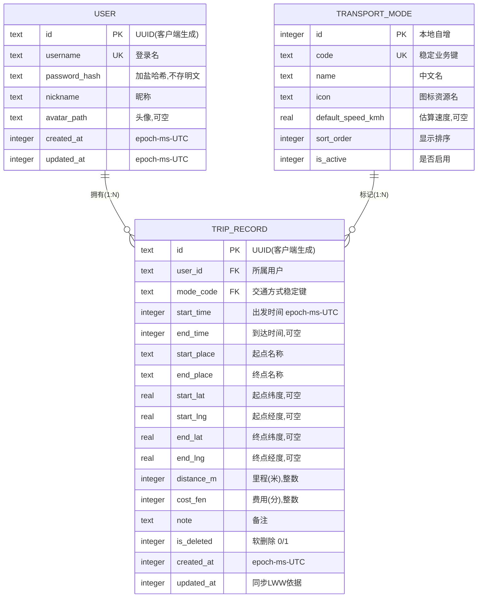

# TransitLog 数据库设计（v0.1 待确认）

> 技术栈：Qt 6 + C++17 + SQLite（本地离线优先），云同步走 HTTP 同步服务。
> 时间统一存 **epoch 毫秒（UTC）**，界面显示时再转本地时区——避免跨时区、跨设备解析歧义。

## 1. ER 图

见 [er-diagram.svg](./er-diagram.svg)，源码：



## 2. 建表 SQL（SQLite）

```sql
PRAGMA foreign_keys = ON;
PRAGMA encoding = 'UTF-8';

-- ========== 用户表 ==========
CREATE TABLE IF NOT EXISTS user (
    id            TEXT PRIMARY KEY,              -- UUID，客户端生成，离线可用
    username      TEXT NOT NULL UNIQUE,          -- 登录名
    password_hash TEXT NOT NULL,                 -- 加盐哈希（PBKDF2/Argon2），绝不存明文
    nickname      TEXT NOT NULL DEFAULT '',
    avatar_path   TEXT,
    created_at    INTEGER NOT NULL,              -- epoch ms (UTC)
    updated_at    INTEGER NOT NULL
);

-- ========== 交通方式字典表（可扩展，随客户端发布/同步下发） ==========
CREATE TABLE IF NOT EXISTS transport_mode (
    id                 INTEGER PRIMARY KEY AUTOINCREMENT,  -- 本地主键
    code               TEXT NOT NULL UNIQUE,   -- 稳定业务键，如 'SUBWAY'；跨设备引用它，不引用 id
    name               TEXT NOT NULL,          -- 中文名：地铁 / 公交 / 步行 ...
    icon               TEXT NOT NULL DEFAULT '',  -- 图标资源名
    default_speed_kmh  REAL,                   -- 估算速度（用于里程估算），可空
    sort_order         INTEGER NOT NULL DEFAULT 0,
    is_active          INTEGER NOT NULL DEFAULT 1
);

-- ========== 行程记录表（核心表） ==========
CREATE TABLE IF NOT EXISTS trip_record (
    id            TEXT PRIMARY KEY,             -- UUID，客户端生成
    user_id       TEXT NOT NULL REFERENCES user(id),
    mode_code     TEXT NOT NULL REFERENCES transport_mode(code),  -- 引用稳定键，不用 id
    start_time    INTEGER NOT NULL,             -- epoch ms (UTC)
    end_time      INTEGER,                      -- 可空：行程进行中/未填
    start_place   TEXT NOT NULL DEFAULT '',
    end_place     TEXT NOT NULL DEFAULT '',
    start_lat     REAL,                         -- 可空：未选地图时为空
    start_lng     REAL,
    end_lat       REAL,
    end_lng       REAL,
    distance_m    INTEGER,                      -- 米，整数（避免浮点误差做聚合）
    cost_fen      INTEGER,                      -- 分，整数（显示时 /100 元）
    note          TEXT NOT NULL DEFAULT '',
    is_deleted    INTEGER NOT NULL DEFAULT 0,   -- 软删除：同步墓碑
    created_at    INTEGER NOT NULL,
    updated_at    INTEGER NOT NULL              -- 同步/冲突解决依据（LWW）
);

CREATE INDEX IF NOT EXISTS idx_trip_user_time ON trip_record(user_id, start_time DESC);
CREATE INDEX IF NOT EXISTS idx_trip_user_del   ON trip_record(user_id, is_deleted);
CREATE INDEX IF NOT EXISTS idx_trip_mode       ON trip_record(mode_code);
```

## 3. 字段设计要点（为什么这样设计）

| 决定 | 理由 |
|---|---|
| 主键用 UUID 而非自增 id | 离线优先同步下，客户端离线也要生成记录；自增 id 跨设备会冲突。 |
| `mode_code` 引用稳定键而非 `transport_mode.id` | 字典表的本地 `id` 在不同设备上可能不同，同步合并时引用 `code`（如 `'SUBWAY'`）才稳定。 |
| 时间存 UTC epoch ms | 字符串时间跨时区解析脆弱；epoch 排序、比较、增量同步都干净。 |
| `distance_m` / `cost_fen` 用整数 | float 做 SUM 聚合有精度误差；元/公里放 UI 层换算，库内只存最小单位整数。 |
| `is_deleted` 软删除 | 删除也是要同步的状态，硬删除会导致别设备残留"幽灵记录"。 |
| 金额/经纬度可空 | 记录可以不填费用、不选地图定位，空值必须能被 UI 正确处理（评审点之一）。 |

## 4. 云同步设计（P0 范围）

**策略：状态同步 + 全量首拉 + 增量合并（Last-Write-Wins）**

- 每张业务表都有 `updated_at` + `is_deleted`，这就是同步的"脏标记"。
- **首次登录**：服务端全量下发该用户的表数据 → 本地建库。
- **增量同步**：本地上传 `updated_at > last_sync_at` 的记录；服务端下发服务端更新的记录。合并规则 **LWW**（比较 updated_at，大者胜）。
- **墓碑**：删除 = `is_deleted = 1` 并刷新 `updated_at`，不下发物理删除，直到对方确认。

设备侧只需一张状态表：

```sql
CREATE TABLE IF NOT EXISTS device_sync_state (
    device_id    TEXT PRIMARY KEY,
    user_id      TEXT NOT NULL,
    last_sync_at INTEGER NOT NULL DEFAULT 0
);
```

> 注意：LWW 对"同一条记录被两端同时修改"是最后提交者覆盖全部字段。对课程项目足够；
> 若未来要按字段合并，则改 op-log 同步（见需求评审文档）。`transport_mode` 是**全局字典**，
> 由服务端统一下发，客户端不编辑（只读引用），避免字典冲突。

## 5. 明确不做（P1+）

- 群组/共享行程、权限（`shared_trip` 关联表）——需求评审里说明为什么 P0 不做
- 行程图片/票据附件（文件同步复杂度高）
- 行程标签（通勤/出差/旅游）——加一张 `trip_tag` 即可，P1
- 断点续传式全量同步协议

---

**请确认**：1) 同步策略选 LWW 状态同步还是 op-log；2) 是否需要 `trip_tag` 标签；3) P0 是否要"进行中行程"（end_time 为空）这个状态。确认后我再进入编码。
