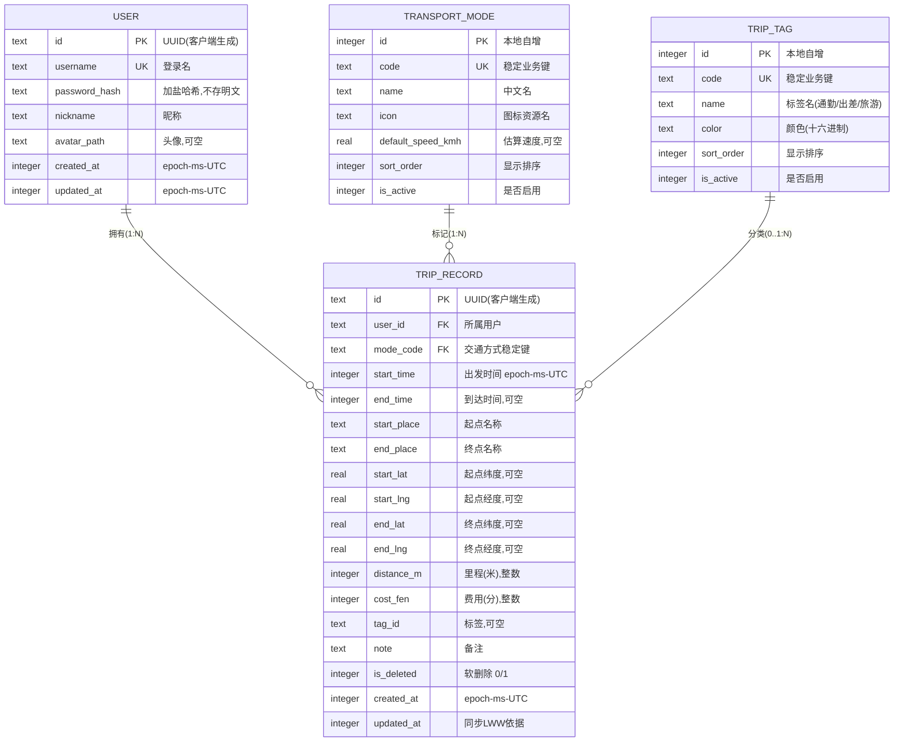

# TransitLog 数据库设计（v0.2 已确认）

> 技术栈：Qt 6 + C++17 + SQLite（**本地单机，无云同步**）。
> 账号 = **本地登录**（用户名+加盐哈希，仅存本机）；多用户/云同步整体推迟到 P1+（2026-08-03 确认）。
> 已确认：LWW 为将来同步策略（当前不用）；行程标签**需要**；**进行中行程**（`end_time` 为空）**做**。
> 时间统一存 **epoch 毫秒（UTC）**，界面显示时再转本地时区——避免跨时区、跨设备解析歧义。

## 1. ER 图

见 [er-diagram.svg](./er-diagram.svg)，源码：



## 2. 建表 SQL（SQLite）

```sql
PRAGMA foreign_keys = ON;
PRAGMA encoding = 'UTF-8';

-- ========== 用户表 ==========
CREATE TABLE IF NOT EXISTS user (
    id            TEXT PRIMARY KEY,              -- UUID，客户端生成，离线可用
    username      TEXT NOT NULL UNIQUE,          -- 登录名
    password_hash TEXT NOT NULL,                 -- 加盐哈希（PBKDF2/Argon2），绝不存明文
    nickname      TEXT NOT NULL DEFAULT '',
    avatar_path   TEXT,
    created_at    INTEGER NOT NULL,              -- epoch ms (UTC)
    updated_at    INTEGER NOT NULL
);

-- ========== 交通方式字典表（可扩展，随客户端发布/同步下发） ==========
CREATE TABLE IF NOT EXISTS transport_mode (
    id                 INTEGER PRIMARY KEY AUTOINCREMENT,  -- 本地主键
    code               TEXT NOT NULL UNIQUE,   -- 稳定业务键，如 'SUBWAY'；跨设备引用它，不引用 id
    name               TEXT NOT NULL,          -- 中文名：地铁 / 公交 / 步行 ...
    icon               TEXT NOT NULL DEFAULT '',  -- 图标资源名
    default_speed_kmh  REAL,                   -- 估算速度（用于里程估算），可空
    sort_order         INTEGER NOT NULL DEFAULT 0,
    is_active          INTEGER NOT NULL DEFAULT 1
);

-- ========== 行程标签字典表 ==========
CREATE TABLE IF NOT EXISTS trip_tag (
    id          INTEGER PRIMARY KEY AUTOINCREMENT,
    code        TEXT NOT NULL UNIQUE,          -- 稳定业务键，如 'COMMUTE'
    name        TEXT NOT NULL,                 -- 通勤 / 出差 / 旅游 ...
    color       TEXT NOT NULL DEFAULT '#888888',
    sort_order  INTEGER NOT NULL DEFAULT 0,
    is_active   INTEGER NOT NULL DEFAULT 1
);

-- ========== 行程记录表（核心表） ==========
CREATE TABLE IF NOT EXISTS trip_record (
    id            TEXT PRIMARY KEY,             -- UUID，客户端生成
    user_id       TEXT NOT NULL REFERENCES user(id),
    mode_code     TEXT NOT NULL REFERENCES transport_mode(code),  -- 引用稳定键，不用 id
    start_time    INTEGER NOT NULL,             -- epoch ms (UTC)
    end_time      INTEGER,                      -- 可空：行程进行中/未填
    start_place   TEXT NOT NULL DEFAULT '',
    end_place     TEXT NOT NULL DEFAULT '',
    start_lat     REAL,                         -- 可空：未选地图时为空
    start_lng     REAL,
    end_lat       REAL,
    end_lng       REAL,
    distance_m    INTEGER,                      -- 米，整数（避免浮点误差做聚合）
    cost_fen      INTEGER,                      -- 分，整数（显示时 /100 元）
    tag_id        TEXT REFERENCES trip_tag(code),  -- 可空：P0 单标签
    vehicle_no    TEXT,                         -- v2 新增：车次/航班号（302路、K262次、CA1234），可空
    vehicle_model TEXT,                         -- v2 新增：车型（CR400AF、DF4D），可空
    note          TEXT NOT NULL DEFAULT '',
    is_deleted    INTEGER NOT NULL DEFAULT 0,   -- 软删除
    created_at    INTEGER NOT NULL,
    updated_at    INTEGER NOT NULL
);

CREATE INDEX IF NOT EXISTS idx_trip_user_time ON trip_record(user_id, start_time DESC);
CREATE INDEX IF NOT EXISTS idx_trip_user_del   ON trip_record(user_id, is_deleted);
CREATE INDEX IF NOT EXISTS idx_trip_mode       ON trip_record(mode_code);
CREATE INDEX IF NOT EXISTS idx_trip_user_vehicle_no  ON trip_record(user_id, vehicle_no);   -- v2
CREATE INDEX IF NOT EXISTS idx_trip_user_vehicle_mdl ON trip_record(user_id, vehicle_model); -- v2
```

> **迁移 v2**：已有数据库通过 `ALTER TABLE trip_record ADD COLUMN vehicle_no/vehicle_model` 增量升级（`PRAGMA user_version` 驱动，`src/app/databasemanager.cpp`）。

## 3. 字段设计要点（为什么这样设计）

| 决定 | 理由 |
|---|---|
| 主键用 UUID 而非自增 id | 离线优先同步下，客户端离线也要生成记录；自增 id 跨设备会冲突。 |
| `mode_code` 引用稳定键而非 `transport_mode.id` | 字典表的本地 `id` 在不同设备上可能不同，同步合并时引用 `code`（如 `'SUBWAY'`）才稳定。 |
| 时间存 UTC epoch ms | 字符串时间跨时区解析脆弱；epoch 排序、比较、增量同步都干净。 |
| `distance_m` / `cost_fen` 用整数 | float 做 SUM 聚合有精度误差；元/公里放 UI 层换算，库内只存最小单位整数。 |
| `is_deleted` 软删除 | 删除要可恢复（未来同步时也是墓碑）；UI 删除需二次确认。 |
| 金额/经纬度可空 | 记录可以不填费用、不选地图定位，空值必须能被 UI 正确处理（评审点之一）。 |

## 4. 云同步（已推迟，P1+）

2026-08-03 确认：**P0 不做多用户 / 云同步，不做云数据库**。账号改为**本地登录**。

- 为将来保留：`updated_at` + `is_deleted` 已在表中，未来若加同步，采用 **LWW 状态同步 + 墓碑**（已确认的策略），只需再加一张 `device_sync_state` 表和同步服务。
- `transport_mode` / `trip_tag` 为本地预置字典，P0 客户端只读。

## 5. 明确不做（P1+）

- 多用户 / 云同步 / 云数据库（本地登录已替代）
- 群组/共享行程、权限（`shared_trip` 关联表）
- 行程图片/票据附件
- 多标签（P0 单标签，`tag_id` 一列；多标签需 junction 表）

---

**已确认（2026-08-03）**：本地登录 ✔ ｜ LWW（未来同步策略）✔ ｜ 行程标签（单标签）✔ ｜ 进行中行程 ✔
待你确认后进入工程初始化与编码。
